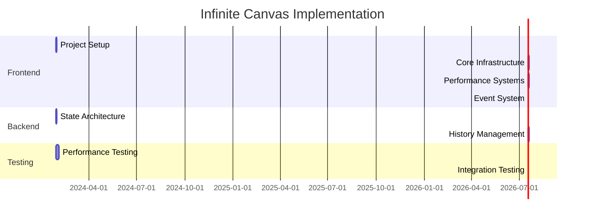

# Infinite Canvas - Work Breakdown Structure

## Frontend Development Tasks

### 1. Project Setup and Architecture (1 day)
- **Owner**: Frontend Developer
- **Dependencies**: None
- **Tasks**:
  1. Set up Fabric.js canvas instance
     - Initialize canvas with container
     - Configure basic canvas settings
     - Set up resize handlers
  2. Implement canvas wrapper component
     - Create React component structure
     - Add canvas initialization logic
     - Handle component lifecycle
  3. Set up performance monitoring
     - Add FPS tracking
     - Implement memory monitoring
     - Configure performance logging

### 2. Core Infrastructure (2 days)
- **Owner**: Frontend Developer
- **Dependencies**: Project Setup
- **Tasks**:
  1. Implement ViewportManager
     - Create viewport state management
     - Add viewport transformation methods
     - Implement bounds calculation
     - Add performance optimizations
  2. Implement GroupManager
     - Set up flat storage structure
     - Add hierarchy management
     - Implement depth tracking
     - Add group validation
  3. Implement EventManager
     - Set up event bus
     - Configure throttling/debouncing
     - Add event categorization
     - Implement performance controls

### 3. Performance Systems (2 days)
- **Owner**: Frontend Developer
- **Dependencies**: Core Infrastructure
- **Tasks**:
  1. Implement Memory Management
     - Create MemoryManager class
     - Add memory tracking
     - Implement warning system
     - Set up cleanup strategies
  2. Implement Rendering Pipeline
     - Create CullingManager
     - Add batch rendering
     - Implement object pooling
     - Add render optimizations
  3. Add Performance Monitoring
     - Set up metrics collection
     - Add performance logging
     - Implement alerts system
     - Create debug tools

### 4. Event System (1 day)
- **Owner**: Frontend Developer
- **Dependencies**: Core Infrastructure
- **Tasks**:
  1. Set up event handlers
     - Add mouse event listeners
     - Implement keyboard shortcuts
     - Handle touch events
  2. Create event manager
     - Implement event delegation
     - Add event throttling
     - Handle event cleanup

## Backend Development Tasks

### 1. State Architecture (2 days)
- **Owner**: Backend Developer
- **Dependencies**: None
- **Tasks**:
  1. Set up Zustand Store
     - Create store configuration
     - Define state structure
     - Add performance middleware
     - Implement selectors
  2. Implement Command System
     - Create command structure
     - Add memory optimization
     - Implement compression
     - Set up validation

### 2. History Management (2 days)
- **Owner**: Backend Developer
- **Dependencies**: State Architecture
- **Tasks**:
  1. Implement History System
     - Create CircularBuffer
     - Add memory limits (50MB max)
     - Implement cleanup
     - Set up monitoring
  2. Add Command Management
     - Implement command storage
     - Add size calculation
     - Set up compression
     - Handle cleanup
  3. Add State Recovery
     - Implement recovery system
     - Add state validation
     - Set up error handling
     - Create recovery UI

## Testing Tasks

### 1. Performance Testing (Ongoing)
- **Owner**: Both Developers
- **Tasks**:
  1. Memory Testing
     - Test memory limits
     - Verify cleanup systems
     - Monitor garbage collection
     - Test recovery scenarios
  2. FPS Testing
     - Monitor render performance
     - Test event throttling
     - Verify smooth operations
     - Profile CPU usage

## Documentation Tasks

### 1. Technical Documentation (Ongoing)
- **Owner**: Both Developers
- **Tasks**:
  1. Code documentation
     - Add JSDoc comments
     - Document class structures
     - Document performance considerations
     - Add memory management notes
  2. API documentation
     - Document public interfaces
     - Add usage examples
     - Document error handling
     - Include performance guidelines

## Timeline and Dependencies

## Success Criteria
1. Performance targets met:
   - Pan/Zoom works and is smooth
   - object manipulation works and is smooth
   - Undo history < 50MB
2. Group operations:
   - Maximum 5 levels of nesting
   - O(1) object lookup
   - Efficient rendering
3. Event handling:
   - Throttled viewport events (60fps)
   - Throttled object events (30fps)
   - Proper debouncing of system events
4. Memory management:
   - No memory leaks
   - Efficient garbage collection
   - Proper cleanup of resources

## Notes for Developers

### Frontend Developer
- Focus on performance optimization from start
- Implement proper event throttling/debouncing
- Use object pooling for frequent operations
- Monitor memory usage and FPS

### Backend Developer
- Implement memory-aware state management
- Use efficient command storage
- Implement proper cleanup strategies
- Monitor state size and history usage
